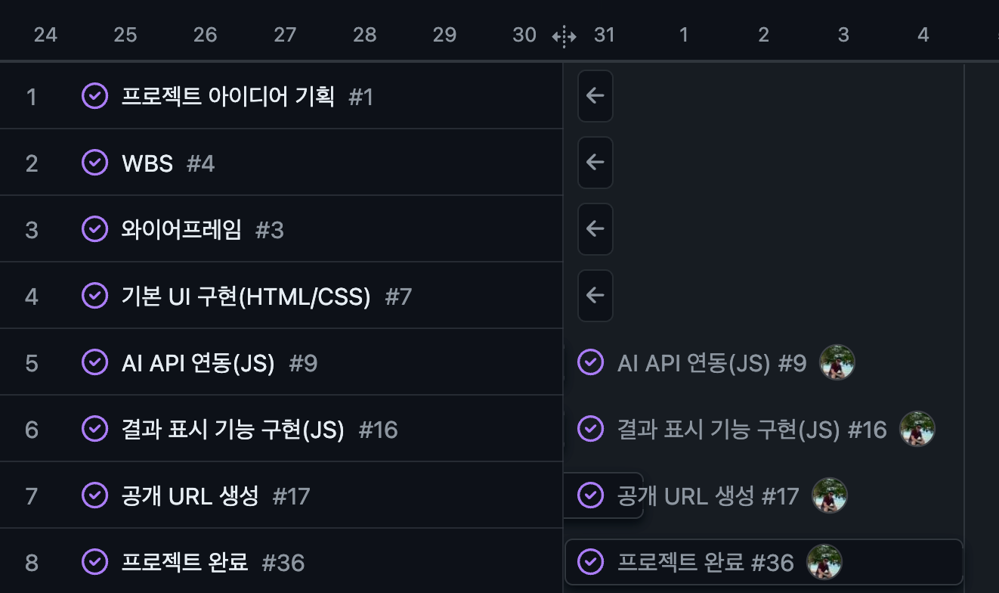
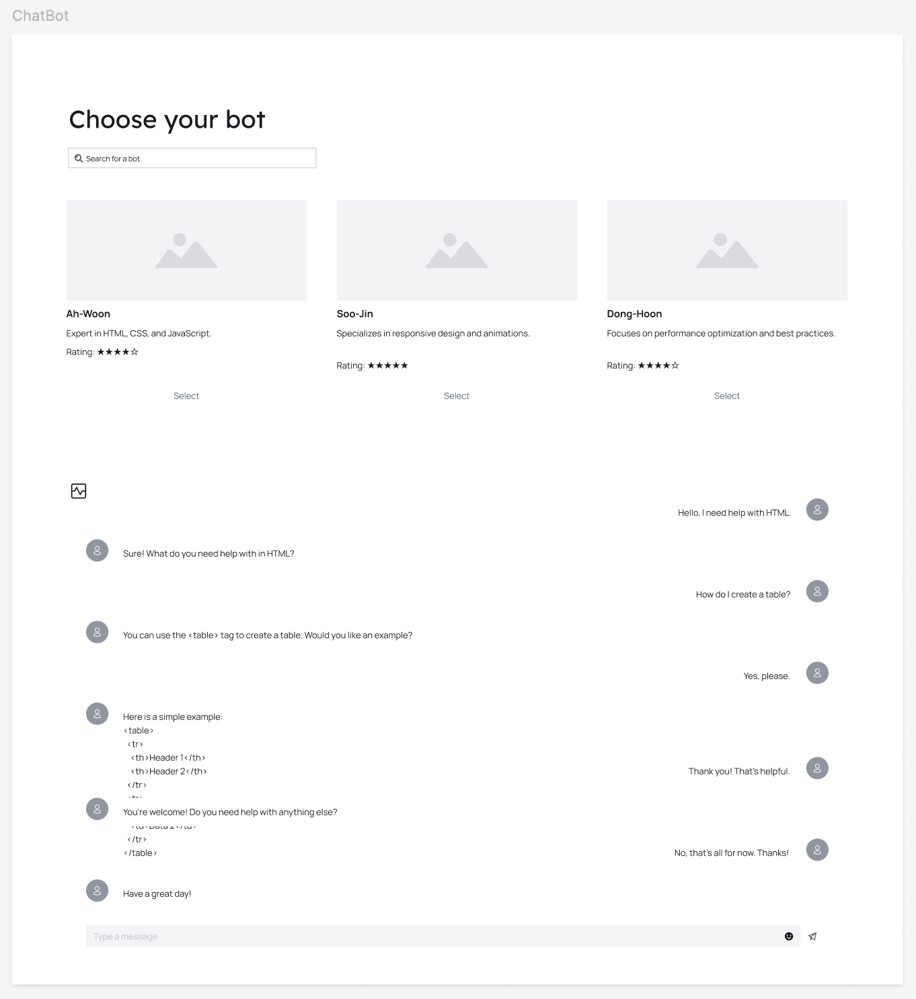

# EasyChatbot4Beginners

## Python 초보자를 위한 Chatbot

- 목표

    - 초보자를 위한 퀴즈를 제공하는 ChatBot 서비스입니다.
  
## 배포 주소

[GithubPages](https://albertimkr.github.io/EasyChatbot4Beginners/)

## WBS(Work Breakdown Structure)


- [프로젝트 보드 보기](https://github.com/users/AlbertImKr/projects/3/views/2)

## 와이어프레임



- [Figma 주소](https://www.figma.com/design/Uzh16al5HdIt7pApcEh0rw/Visily-(Community)?node-id=0-1&t=NwnYITf6yJNRqjdp-1)

## 시연

### 1. 마스터 검색이 가능합니다.

- 마스터 정보는 JSON 파일에서 데이터를 가져와서 렌더링했습니다.
- `style= "display: none"`으로 속성을 사용하여 마스터를 숨겼습니다.
- `type="radio"` 속성을 사용하여 마스터를 하나만 선택할 수 있도록 설정했습니다.


### 2. 마스터를 선택하면 채팅방으로 전환합니다.

- 입력 값을 `1`, `2`, `3`, `4`, `시작` 문자로 제한했습니다. 이 외의 문자가 입력될 경우 경고창이 표시됩니다.
- 선택한 마스터 정보를 가져와서 오른쪽 상단에 고정했습니다.
- 선택한 마스터 이미지를 가져와서 채팅 이미지로 사용했습니다
- 기다리는 동안 추가 입력을 방지하기 위해 disabled 속성을 사용하여 제한했습니다.


### 3. 채팅방 화면에서 마스터 검색 기능이 가능하며 마스터를 전환할 수 있습니다.

- 퀴즈 진행 중에도 검색창을 사용할 수 있도록 구현했습니다.
- 다른 마스터를 선택도지 않으면 마스터 리스트가 다시 숨겨집니다.


## 어려움 및 해결 과정

### 1. 채팅방 화면에서 마스터 리스트를 다시 표시하고 숨기는 기능 구현

input 텍스트 변경 이벤트, input 텍스트 클릭 등 여러 이벤트를 고려했으나 모두 적합하지 않거나 충돌이 발생했습니다.

이를 해결하기 위해 검색창에 텍스트를 입력하면 리스트가 항상 표시되도록 하였습니다. 대신 document의 click 이벤트를 사용하여 document.activeElement 속성을 통해 현재 활성화된 요소가 검색창이 아닐 때
전역 display 속성을 참조하여 마스터 리스트를 숨기거나 표시하도록 구현했습니다.

- 마스터를 선택하지 않은 상태에서는 전역 display 변수를 true
- 마스터를 선택한 상태에서는 display 변수를 false

### 2. 화면에 표시할 필요 없는 `label`, `h2`, `h3` 등을 숨기기

- `display: none;`을 사용하면 해당 요소는 화면에서 완전히 제거되므로 읽을 수 없습니다. 스크린 리더의 탐색 대상에서도 제외됩니다. 
- `visibility: hidden;`은 시각적으로 숨기지만 여전히 화면의 공간을 차지합니다.
- 이를 해결하기 위해 요소를 화면 밖으로 이동시켜 시각적으로 숨겼습니다. 이렇게 하면 요소는 화면에 보이지 않으며 화면의 공간도 차지하지 않게 됩니다.

```css
  .example {
    position: absolute;
    left: -9999px; /* 화면 밖으로 이동시켜 시각적으로 숨김 */
    clip: rect(0, 0, 0, 0); /* 시각적으로 보이지 않게 함 */
    clip-path: inset(50%); /* 추가적인 호환성을 위한 클리핑 */
    overflow: hidden; /* 오버플로우 숨기기 */
    height: 1px; /* 높이 1px 설정 */
    width: 1px; /* 너비 1px 설정 */
  }
```

### 3. 위치 고정 문제 

검색창과 입력창을 최상단과 최하단에 고정하고 중간의 콘텐츠만 확장하고 싶었습니다.
- 처음에는 `position: sticky`를 고려해보았으나 콘텐츠에 붙어 있긴 하지만 콘텐츠가 `sticky` 요소 뒤로 넘어가서 가시성이 좋지 않았습니다. 
  - 예를 들어 `sticky`요소의 마진에서 콘텐츠가 가려지지 않아 보이는 현상이 발생했습니다.
- 그래서 `position: fixed`를 사용해서 해결했지만 중간 콘텐츠의 상하 마진을 추가해야 하는 문제가 있습니다.

## 느낀 부분

제일 어려운 부분은 프레임을 어떻게 분리할 것인지에 대한 문제였습니다.
여러 번 수정해서 현재 구조가 되였습니다. 
또한 JavaScript 파일의 분리도 필요할 것 같습니다. 
JavaScript 파일이 너무 많은 함수를 포함되여 있지만 이름을 명확히 지정하였기에 관리할 수 있었고 코드를 찾는도 도움이 되였습니다. 
CSS 파일도 마찬가지로 다시 한 번 이름을 명확히 지정하는 것의 중요성을 느꼈습니다.
